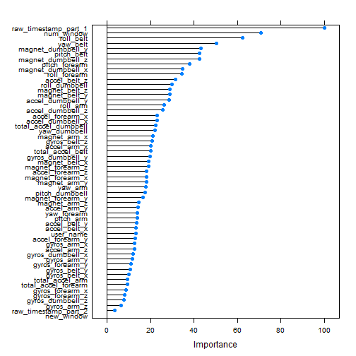

#### Executive Summary
Using modern exercise devices such as Fitbit it is now possible to collect a large amount of data about personal activity relatively inexpensively. One thing that people regularly do is quantify how much of a particular activity they do, but they rarely quantify how well they do it. In this project, the goal will be to use data from accelerometers on the belt, forearm, arm, and dumbell of 6 participants. They were asked to perform barbell lifts correctly and incorrectly in 5 different ways. More information is available from the website here: http://groupware.les.inf.puc-rio.br/har (see the section on the Weight Lifting Exercise Dataset). 


#### Objective

The goal of the project is to predict the manner in which they did the exercise. This is the "classe" variable in the training set. The report will describe how the author built the model, used cross validation, explain what expected out of sample error is. The prediction model designed will be used to predict 20 different test cases. 

Later the machine learning algorithm will be applied to each of the 20 test cases in the testing data set. For each test case a text file will be submitted with a single capital letter (A, B, C, D, or E) corresponding to the prediction for the corresponding problem in the test data set. 


##### Initial Setup


```
## Warning: package 'ggplot2' was built under R version 3.1.3
```

```
## Warning: package 'caret' was built under R version 3.1.3
```

```
## Warning: package 'doParallel' was built under R version 3.1.3
```

```
## Loading required package: foreach
```

```
## Warning: package 'foreach' was built under R version 3.1.3
```

```
## foreach: simple, scalable parallel programming from Revolution Analytics
## Use Revolution R for scalability, fault tolerance and more.
## http://www.revolutionanalytics.com
## Loading required package: iterators
```

```
## Warning: package 'iterators' was built under R version 3.1.3
```

```
## Loading required package: parallel
```

##### Data Load & Tidy Up

```r
setInternet2(TRUE) 
trainURL <- "https://d396qusza40orc.cloudfront.net/predmachlearn/pml-training.csv"
testURL <- "https://d396qusza40orc.cloudfront.net/predmachlearn/pml-testing.csv"

trainingData <- read.csv(url(trainURL), na.strings=c("NA","#DIV/0!",""))
testingData <- read.csv(url(testURL), na.strings=c("NA","#DIV/0!",""))

##Leave in data where columns having 20% NAs. Rest are removed.
checkNAs <-which((colSums(!is.na(trainingData)) >= 0.8*nrow(trainingData)))
trainingData <- trainingData[,checkNAs]
testingData     <- testingData[,checkNAs]

## testingData <- testingData[-ncol(testingData)]
testingData$new_window <- factor(testingData$new_window, levels=c("yes","no"))

trainingData <- trainingData[,-c(1,5)]
testingData<- testingData[,-c(1,5)]
```


##### Create test training sets

```r
inTraining  <- createDataPartition(trainingData$classe, p = 0.8, list = FALSE)
training    <- trainingData[inTraining, ]
testing     <- trainingData[-inTraining, ]
```


##### Operation : Parallel Random Forest

This assignment will use Parallel Random Forest for model fit.


```r
class <- training$classe
data  <- training[-ncol(training)]
registerDoParallel()
plotterData <- train(data, class, method="parRF",  tuneGrid=data.frame(mtry=3),  trControl=trainControl(method="none"))
```

```
## Loading required package: randomForest
```

```
## Warning: package 'randomForest' was built under R version 3.1.3
```

```
## randomForest 4.6-10
## Type rfNews() to see new features/changes/bug fixes.
```

```r
plotterData
```

```
## Parallel Random Forest 
## 
## 15699 samples
##    57 predictor
##     5 classes: 'A', 'B', 'C', 'D', 'E' 
## 
## No pre-processing
## Resampling: None
```


##### Plot Model

```r
plot(varImp(plotterData))
```

 

##### Confusion MATRIX : Testing Data

Here we generate a confusion matrix against the testingData Set


```r
matrixData <- predict(plotterData, newdata=testing)
confusionMatrixData <- confusionMatrix(matrixData,testing$classe)
confusionMatrixData
```

```
## Confusion Matrix and Statistics
## 
##           Reference
## Prediction    A    B    C    D    E
##          A 1116    0    0    0    0
##          B    0  759    2    0    0
##          C    0    0  682    1    0
##          D    0    0    0  641    0
##          E    0    0    0    1  721
## 
## Overall Statistics
##                                           
##                Accuracy : 0.999           
##                  95% CI : (0.9974, 0.9997)
##     No Information Rate : 0.2845          
##     P-Value [Acc > NIR] : < 2.2e-16       
##                                           
##                   Kappa : 0.9987          
##  Mcnemar's Test P-Value : NA              
## 
## Statistics by Class:
## 
##                      Class: A Class: B Class: C Class: D Class: E
## Sensitivity            1.0000   1.0000   0.9971   0.9969   1.0000
## Specificity            1.0000   0.9994   0.9997   1.0000   0.9997
## Pos Pred Value         1.0000   0.9974   0.9985   1.0000   0.9986
## Neg Pred Value         1.0000   1.0000   0.9994   0.9994   1.0000
## Prevalence             0.2845   0.1935   0.1744   0.1639   0.1838
## Detection Rate         0.2845   0.1935   0.1738   0.1634   0.1838
## Detection Prevalence   0.2845   0.1940   0.1741   0.1634   0.1840
## Balanced Accuracy      1.0000   0.9997   0.9984   0.9984   0.9998
```


The accuracy is as below

```r
confusionMatrixData$overall[1]
```

```
##  Accuracy 
## 0.9989804
```

##### Writing Files


```r
pml_write_files = function(x){
  n = length(x)
  for(i in 1:n){
    filename = paste0("problem_id_",i,".txt")
    write.table(x[i],file=filename,quote=FALSE,row.names=FALSE,col.names=FALSE)
  }
}

answers <- predict(plotterData, testingData)
pml_write_files(answers)
```


